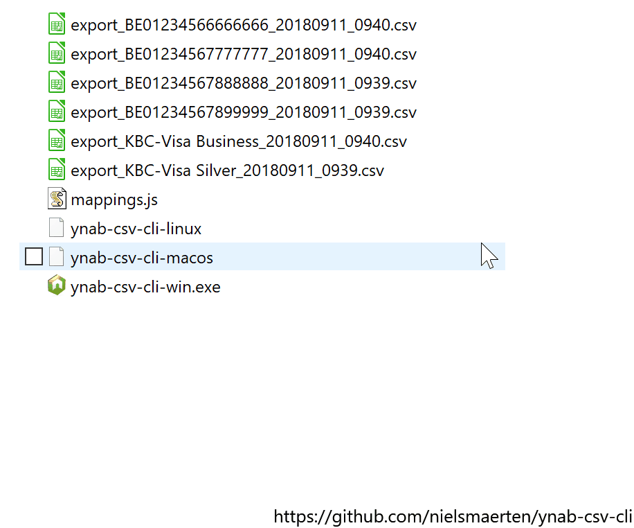

# YNAB-CSV-CLI

**A simple drag-and-drop tool to convert your bank's CSV statements into YNAB format.**

## Demo



## How to use

1. [Download](https://github.com/nielsmaerten/ynab-csv-cli/releases) ynab-csv-cli
2. Check `mappings.js` and make sure there's a mapping for your bank's file format
3. Drop CSV files on the executable
4. Import the resulting files into YNAB

## Purpose

ynab-csv-cli is forked from:
https://github.com/aniav/ynab-csv and https://github.com/halloffame/ynab-csv

This project is my attempt to address 2 issues I had with the original:

- they had to run in Chrome
- you had to set the mappings for every new file

ynab-csv-cli remembers mappings in a separate file, so you can convert files by simply dropping them onto the tool.

## Building

To test a CSV file; edit `convert-csv.test.ts`, then run:

```
npm run test
```

To build Typescript:

```
npm run build:js
```

To build binaries:

```
npm run build:bin
```

## Contributing

Right now, this tool only converts the files by my bank (KBC Belgium).  
Pull requests with mappings for different banks are highly appreciated! :)

This project is released with a Contributor Code of Conduct. By participating in this project you agree to abide by its terms.
